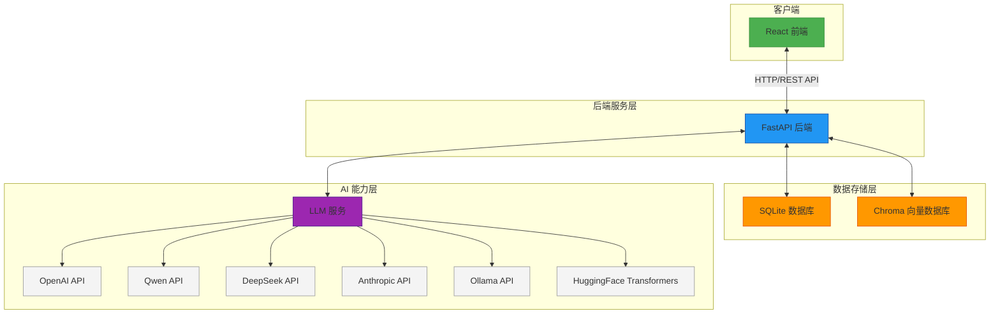
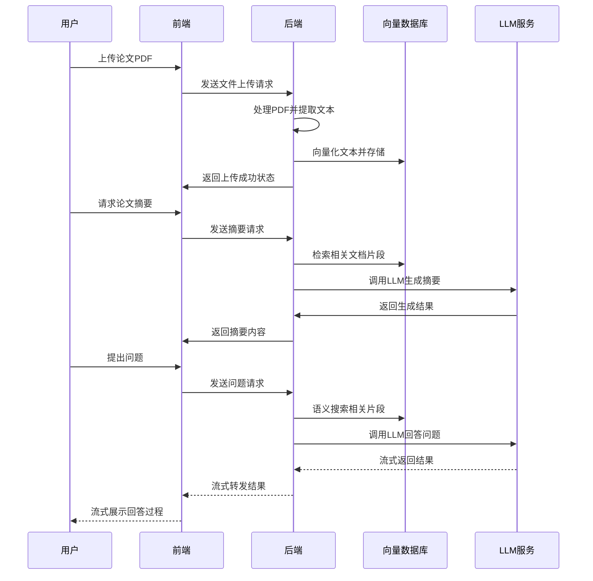

# 📚 Paper Agent - 智能论文助手

[](https://opensource.org/licenses/MIT)
[](https://www.python.org/downloads/)
[](https://fastapi.tiangolo.com/)
[](https://reactjs.org/)

一个基于大语言模型的智能论文助手，帮助研究人员高效地搜索、分析和理解学术论文。通过多种AI模型支持和流式响应技术，提供沉浸式的学术研究体验。

## 🎯 解决的核心痛点

学术研究中面临的挑战：
- 🔍 **信息过载**：面对海量论文，难以快速找到关键信息
- 📊 **理解困难**：复杂论文难以快速掌握核心要点
- ⏱️ **效率低下**：传统阅读方式耗时耗力
- 🤖 **缺乏智能分析**：缺少AI辅助的深度分析工具
- 🌐 **模型局限性**：单一模型无法满足多样化需求

Paper Agent 通过以下方式解决这些痛点：
- 智能论文搜索和推荐系统
- 多模型支持的论文分析和总结
- 流式响应和思考模式展示AI推理过程
- 可视化界面提升用户体验
- 灵活的部署方式适应不同环境需求

## 🏗️ 系统架构



### 架构说明

1. **客户端层**：
   - 基于 React 构建的现代化前端界面
   - 提供直观的用户交互体验
   - 支持流式响应和思考模式展示

2. **服务层**：
   - 基于 FastAPI 构建的高性能后端服务
   - 提供 RESTful API 接口
   - 实现业务逻辑处理和模块协调

3. **数据存储层**：
   - SQLite：存储文档元数据和处理状态
   - ChromaDB：存储文档向量化表示，支持语义搜索

4. **AI能力层**：
   - 抽象的 LLM 服务层，支持多种模型提供商
   - 统一接口适配不同模型的 API
   - 支持流式响应和同步响应模式

### 核心工作流程



## 🚀 当前支持的模型

Paper Agent 支持多种主流大语言模型，满足不同场景需求：

### ☁️ 云端模型
| 模型提供商 | 模型系列 | 特点 |
|------------|----------|------|
| **OpenAI** | GPT-3.5, GPT-4 | 通用性强，理解能力优秀 |
| **Qwen** | 通义千问系列 | 中文理解能力出色 |
| **DeepSeek** | DeepSeek系列 | 高性价比，代码理解能力强 |
| **Anthropic** | Claude系列 | 逻辑推理能力强，安全性高 |

### 🖥️ 本地模型
| 模型提供商 | 模型系列 | 特点 |
|------------|----------|------|
| **Ollama** | Llama系列 | 本地部署，隐私安全 |
| **HuggingFace** | 多种开源模型 | 灵活定制，完全控制 |

## 🛠️ 多种部署方式

Paper Agent 提供多种部署方式，适应不同用户需求：

### 🐍 使用uv（推荐）
```bash
# 安装uv（如果尚未安装）
pip install uv

# 克隆项目
git clone https://github.com/yourusername/paper-agent.git
cd paper-agent

# 创建虚拟环境并安装依赖
uv venv
source .venv/bin/activate  # Linux/Mac
# 或 .venv\Scripts\activate  # Windows

uv pip install -r requirements.txt

# 运行后端
cd backend
python main.py

# 运行前端（新终端窗口）
cd frontend
npm install
npm start
```

### 🐳 Docker部署（生产环境推荐）
```bash
# 构建镜像
docker-compose build

# 启动服务
docker-compose up -d

# 访问应用
# 前端: http://localhost:3000
# 后端API: http://localhost:8000
```

### 🐍 传统虚拟环境方式
```bash
# 克隆项目
git clone https://github.com/yourusername/paper-agent.git
cd paper-agent

# 创建虚拟环境
python -m venv venv
source venv/bin/activate  # Linux/Mac
# 或 venv\Scripts\activate  # Windows

# 安装依赖
pip install -r requirements.txt

# 运行后端
cd backend
python main.py

# 运行前端（新终端窗口）
cd frontend
npm install
npm start
```

## 📁 项目结构

```
paper_agent/
├── backend/                 # FastAPI后端服务
│   ├── api/                 # API路由
│   │   └── routes/
│   │       ├── documents.py # 文献管理API
│   │       ├── search.py    # 搜索API
│   │       └── summary.py   # 摘要生成API
│   ├── config/              # 配置
│   │   └── settings.py      # 配置管理
│   ├── models/              # 数据模型
│   │   └── document.py      # 文献模型
│   ├── services/            # 业务逻辑
│   │   ├── pdf_processor.py # PDF处理服务
│   │   ├── vector_service.py # 向量数据库服务
│   │   ├── llm_service.py   # 大语言模型服务
│   │   └── database.py      # 数据库服务
│   └── main.py              # FastAPI入口
├── frontend/                # React前端
│   ├── public/
│   ├── src/
│   │   ├── components/      # 组件
│   │   ├── pages/          # 页面
│   │   ├── services/       # API服务
│   │   └── App.js          # 主应用
├── paper_agent/            # 核心论文处理模块
│   ├── __init__.py         # 包初始化
│   ├── agent.py            # 主要接口类
│   ├── search.py           # 搜索模块
│   ├── analyzer.py         # 分析模块
│   └── utils.py            # 工具模块
├── config/
│   └── config.yaml         # 配置文件
├── data/
│   ├── pdfs/              # PDF存储
│   └── vector_db/         # 向量数据库
├── tests/                 # 测试文件
├── requirements.txt       # Python依赖
└── README.md             # 项目说明
```

## ⚙️ 配置说明

系统支持多种配置方式：

### 环境变量配置
```bash
export OPENAI_API_KEY="your_openai_api_key"
export QWEN_API_KEY="your_qwen_api_key"
export DEEPSEEK_API_KEY="your_deepseek_api_key"
export ANTHROPIC_API_KEY="your_anthropic_api_key"
export LOG_LEVEL="INFO"
```

### 配置文件 (config/config.yaml)
```yaml
llm:
  provider: "openai"  # 可选: "huggingface", "openai", "anthropic", "qwen", "deepseek", "ollama"
  model: "gpt-3.5-turbo"
  api_key: "your_openai_api_key"
  qwen_api_key: "your_qwen_api_key"
  qwen_model: "qwen-plus"
  deepseek_api_key: "your_deepseek_api_key"
  deepseek_model: "deepseek-chat"
  ollama_model: "llama3"
  ollama_base_url: "http://localhost:11434/v1"
  anthropic_api_key: "your_anthropic_api_key"
  anthropic_model: "claude-3-haiku-20240307"
  temperature: 0.7
  max_tokens: 1000

embedding:
  model: "all-MiniLM-L6-v2"
  dimension: 384

vector_db:
  provider: "chromadb"
  path: "./data/vector_db"

server:
  host: "0.0.0.0"
  port: 8000
```

## 🌟 核心特性

### 🤯 思考模式
展示AI的完整推理过程，包括：
- 问题分析阶段
- 信息检索过程
- 答案构建步骤
- 可视化进度展示

### 🌊 流式响应
- 实时文本输出效果
- 更自然的交互体验
- 减少用户等待焦虑

### 🧠 多模型支持
- 前端模型选择器
- 动态切换模型提供商
- 统一API接口设计

### 🎨 现代化界面
- 响应式设计
- 直观的操作流程
- 美观的视觉效果

## 📈 未来扩展计划

| 版本 | 功能 | 状态 |
|------|------|------|
| v1.0 | 基础架构和核心功能 | ✅ 已完成 |
| v1.1 | 多模型支持和思考模式 | ✅ 已完成 |
| v1.2 | 高级搜索和推荐系统 | 🔄 开发中 |
| v1.3 | 论文对比和可视化分析 | 📅 计划中 |
| v1.4 | 协作功能和知识图谱 | 📅 计划中 |
| v1.5 | 移动端适配和PWA支持 | 📅 计划中 |

### 🔮 长期规划
- 🤝 **多语言支持**：支持更多语言的论文处理
- 🧬 **学术领域定制**：针对不同学科领域的优化模型
- 📊 **数据可视化**：论文引用关系图谱和趋势分析
- 🤖 **智能助手**：语音交互和更自然的对话体验
- 🔗 **插件系统**：支持第三方工具集成

## 🤝 贡献指南

我们欢迎任何形式的贡献！

### 开发环境设置
1. Fork 项目
2. 创建功能分支 (`git checkout -b feature/AmazingFeature`)
3. 提交更改 (`git commit -m 'Add some AmazingFeature'`)
4. 推送到分支 (`git push origin feature/AmazingFeature`)
5. 开启 Pull Request

### 开发规范
- 遵循现有代码风格
- 添加适当的测试用例
- 更新相关文档
- 保持提交信息清晰明了

## 📄 许可证

本项目采用 MIT 许可证 - 查看 [LICENSE](LICENSE) 文件了解详情

## 🙏 致谢

- 感谢所有开源项目提供的支持
- 感谢社区贡献者的宝贵意见和建议

---

<p align="center">Made with ❤️ for researchers worldwide</p>