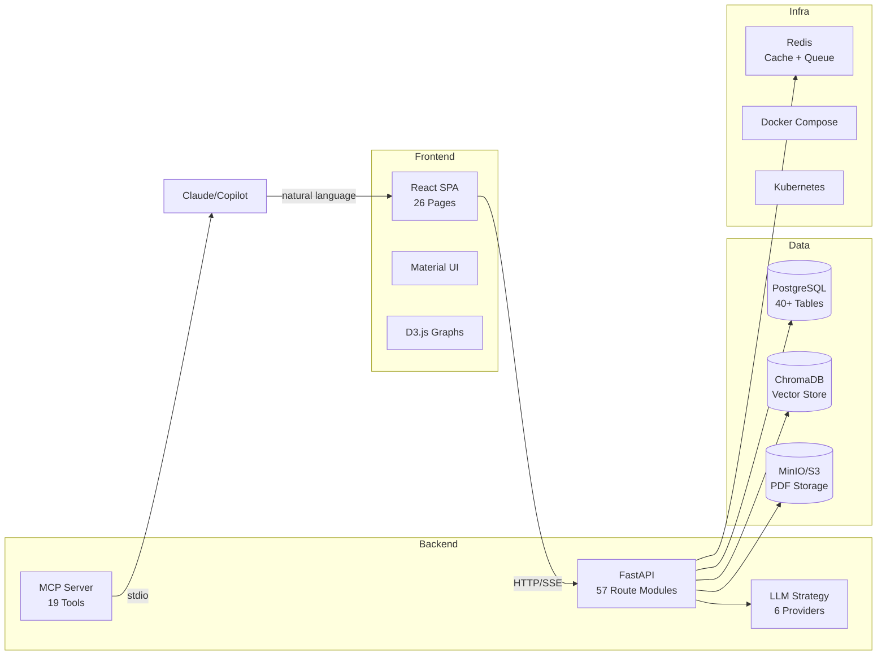

# Architecture

System design overview of Paper Agent.

## High-Level Architecture

## Key Design Decisions

### Monorepo Structure
Single repository containing both frontend and backend for easier development and deployment.

### Service Registry Pattern
`backend/services/registry.py` provides centralized dependency injection, avoiding circular imports and enabling lazy initialization.

### LLM Strategy Pattern
Unified interface for 6 providers with graceful degradation — if one fails, the next is tried automatically.

### REST + SSE
Synchronous endpoints for CRUD operations, Server-Sent Events for streaming AI responses.

## By the Numbers

| Metric | Value |
|--------|-------|
| API Routes | 57 |
| Frontend Pages | 26 |
| Database Tables | 40+ |
| MCP Tools | 19 |
| LLM Providers | 6 |
| Research Skills | 6 |
| Supported Langs | 2 (EN/ZH) |
| Python Version | 3.10+ |
| React Version | 18 |
