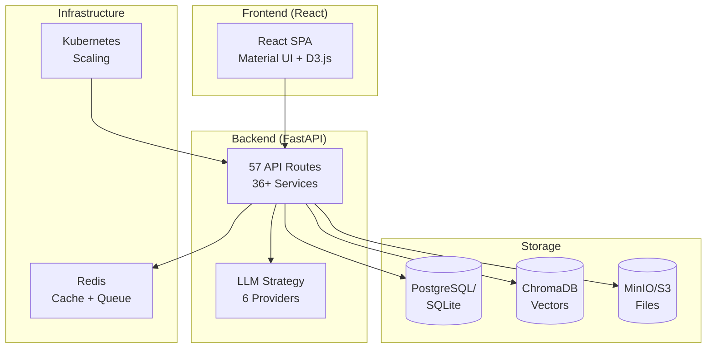

# 🚀 Paper Agent Documentation

Welcome to the Paper Agent documentation! Paper Agent is your **AI Research Companion** — an open-source, enterprise-grade academic literature management platform.

<div class="grid cards" markdown>

-   :material-clock-fast:{ .lg .middle } **Get Started in 5 Minutes**

    ---

    Install with Docker Compose and manage your first paper.

    [:octicons-arrow-right-24: Installation Guide](installation.md)

-   :material-book-open-variant:{ .lg .middle } **Complete User Guide**

    ---

    Learn every feature: from document management to AI analysis.

    [:octicons-arrow-right-24: User Guide](user-guide/index.md)

-   :material-api:{ .lg .middle } **API Reference**

    ---

    Full API documentation with examples for all endpoints.

    [:octicons-arrow-right-24: API Reference](api/index.md)

-   :material-sitemap:{ .lg .middle } **Architecture**

    ---

    Understand the system design, data flow, and security model.

    [:octicons-arrow-right-24: Architecture](architecture/index.md)

-   :material-robot:{ .lg .middle } **MCP Integration**

    ---

    Connect any MCP-compatible AI assistant to your library.

    [:octicons-arrow-right-24: MCP Guide](mcp.md)

-   :material-brain:{ .lg .middle } **AI Research Skills**

    ---

    Pre-built workflows for literature review, gap analysis, and more.

    [:octicons-arrow-right-24: Research Skills](skills.md)

</div>

---

## ✨ What Can You Do?

| Feature | Description |
|---------|-------------|
| 📚 **Document Management** | Upload, organize, and search your PDF library |
| 🧠 **AI Summarization** | Academic, simple, or detailed summaries with streaming |
| 🕸️ **Knowledge Graph** | Interactive visualization of paper relationships |
| 🔬 **Research Analysis** | Contradiction detection, gap analysis, trend spotting |
| ✍️ **Writing Assistant** | Literature review generation, citation management |
| 👥 **Team Workspaces** | Shared libraries, annotations, and team goals |
| 🔔 **Smart Alerts** | Get notified when new papers match your interests |
| 🧠 **Flashcards** | Spaced repetition for paper recall (SM-2 algorithm) |
| 🔗 **MCP Protocol** | Connect AI assistants to your research library |
| 📊 **Reading Analytics** | Track your reading habits and progress |

## 🚀 Quick Start

```bash
# One-command setup
git clone https://github.com/KingdeGuo/paper-agent.git
cd paper-agent
cp .env.example .env
docker-compose up -d

# Open http://localhost:3000
```

## 🏗️ System Architecture



## 📚 Documentation Sections

| Section | Description |
|---------|-------------|
| [Getting Started](installation.md) | Installation, configuration, deployment |
| [User Guide](user-guide/index.md) | Complete feature walkthrough |
| [API Reference](api/index.md) | All 57 routes documented with examples |
| [Architecture](architecture/index.md) | System design and data flow |
| [MCP Integration](mcp.md) | Connect AI assistants to your library |
| [Contributing](contributing.md) | How to contribute code |
| [FAQ](faq.md) | Frequently asked questions |
| [Changelog](changelog.md) | Release history |
| [Roadmap](roadmap.md) | Upcoming features |

---

## 🤝 Community

- [GitHub Issues](https://github.com/KingdeGuo/paper-agent/issues) — Bug reports, feature requests
- [GitHub Discussions](https://github.com/KingdeGuo/paper-agent/discussions) — Q&A, ideas
- [Email](mailto:kingdeguo01@gmail.com) — Direct contact
