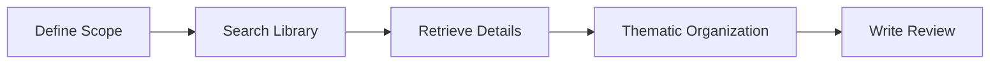

# AI Research Skills

Pre-built research workflows for common academic tasks.

## What are Skills?

Skills are structured prompts that guide AI assistants through multi-step research tasks. Each skill leverages Paper Agent's MCP tools to accomplish complex workflows.

## Available Skills

### 📚 Literature Review
Generate a comprehensive, well-structured literature review section.

**Use case:** Writing the "Related Work" section for a paper or thesis chapter.

### 🔬 Deep Paper Analysis
Systematic analysis of a single paper across 6 dimensions.

**Use case:** Understanding a paper's contributions, methodology, and limitations.

### 🎯 Research Gap Analysis
Identify underexplored areas and generate novel hypotheses.

**5 Gap Types:** Methodology, Evidence, Population, Practical, Temporal

**Use case:** Finding novel research directions for a PhD or grant proposal.

### 🌅 Daily Research Briefing
Get a concise daily briefing of library activity and reading priorities.

**Use case:** Starting each day with a clear research agenda.

### ✍️ Writing Assistant
Write academic text with proper citation support.

**Use case:** Drafting sections of a paper with inline citations and automatic bibliography.

### 📋 Systematic Review
PRISMA-compliant systematic literature review.

**6 Phases:** Research Questions → Search → Screening → Extraction → Synthesis → Report

**Use case:** Conducting a rigorous systematic review for publication.

## How to Use Skills

1. Ensure the Paper Agent MCP server is running
2. Open any MCP-compatible AI assistant
3. Load a skill by describing your task
4. Follow the step-by-step workflow

Example: "I need to write a literature review on attention mechanisms. Use my papers on this topic."
